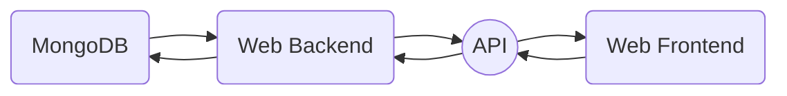

## ESP CUSTOMS
###  Español
`EspCustoms es un proyecto empresarial que empezo a mediados de 2020 y ha ido escalando cada vez a mas, siendo actualmente uno de los bots de discord con mas funciones activas.`

`(Por razones de seguridad, MongoDB nunca se conecta directamente al Web Frontend.)`

###  English
`EspCustoms is an entrepreneurial project that started in mid-2020 and has been escalating more and more, being currently one of the most active discord bots.`

`(For security reasons MongoDB never connects directly to the Web Frontend.)`

### How our services work

